# スタイル確認用サンプル

`<Leader>r` で変換したときの見た目を確かめるための文書。pandoc で有効にしている Markdown の要素と、Mermaid の図をひととおり並べている。

## 文章

吾輩は猫である。名前はまだ無い。どこで生れたかとんと見当がつかぬ。何でも薄暗いじめじめした所でニャーニャー泣いていた事だけは記憶している。吾輩はここで始めて人間というものを見た。しかもあとで聞くとそれは書生という人間中で一番獰悪な種族であったそうだ。

The quick brown fox jumps over the lazy dog. 和文と欧文 (English) が混ざった段落では、字間や行の高さが揃っているかを見る。数字は 1234567890、記号は !?#%&@ のように並ぶ。

文中の装飾には、*強調*、**強い強調**、***両方***、`inline code`、[リンク](https://example.com/)、[属性付きのリンク](https://example.com/){.external}、[範囲指定]{.right} がある。
行末にスペースを 2 つ置くと  
このように改行される。

URL のように長くて区切れない文字列は折り返しを確かめる: https://example.com/very/long/path/that/does/not/contain/any/spaces/and/keeps/going/on/and/on/until/it/overflows/the/line

### 脚注

本文に脚注を付ける[^note]。同じ段落にもう 1 つ付ける[^long]。インラインの脚注^[その場に書く脚注。]も使える。

[^note]: 短い脚注。
[^long]: 長い脚注。脚注が複数行に折り返したときの字下げと、末尾の戻るリンクの位置を確かめる。脚注が複数行に折り返したときの字下げと、末尾の戻るリンクの位置を確かめる。

### 数式

文中の数式は $e^{i\pi} + 1 = 0$ のように書く。独立した数式は次のとおり。

$$
\int_{-\infty}^{\infty} e^{-x^2} \, dx = \sqrt{\pi}
$$

$$
\begin{aligned}
(a + b)^2 &= a^2 + 2ab + b^2 \\
(a - b)^2 &= a^2 - 2ab + b^2
\end{aligned}
$$

## 見出し

### 見出し 3

見出しの直後の段落。

#### 見出し 4

見出しの直後の段落。

##### 見出し 5

見出しの直後の段落。

###### 見出し 6

見出しの直後の段落。

### 見出しが続く場合

#### 直後に下位の見出し

段落。

### `code` を含む見出しと[リンク](https://example.com/)

段落。

## リスト

### 箇条書き

- 1 段目
- `code` で始まる項目と、途中に `code` がある項目、`a` と `b` と `c`
- [リンク](https://example.com/)と*強調*と**強い強調**が並ぶ項目
    - 2 段目
    - 2 段目の長い項目。折り返したときに行頭が揃うかを確かめる。折り返したときに行頭が揃うかを確かめる。折り返したときに行頭が揃うかを確かめる。
        - 3 段目
        - 3 段目
- 1 段目に戻る

### 番号付き

1. 最初の手順
2. 次の手順
    1. 入れ子の手順
    2. 入れ子の手順
        - 番号なしの入れ子
3. 最後の手順

### 段落を含む項目

- 1 つ目の項目の最初の段落。

    同じ項目の 2 つ目の段落。`code` を含む。

    ```sh
    echo "項目の中のコードブロック"
    ```

    > 項目の中の引用。

- 2 つ目の項目の最初の段落。

    | 列 | 値 |
    |----|----|
    | a  | 1  |

### 定義リスト

用語
:   用語の説明。

長い用語 `code`
:   1 つ目の説明。説明が長くなり折り返す場合の字下げを確かめる。説明が長くなり折り返す場合の字下げを確かめる。
:   2 つ目の説明。

## 引用

> 引用の段落。引用が長くなり折り返す場合を確かめる。引用が長くなり折り返す場合を確かめる。引用が長くなり折り返す場合を確かめる。
>
> 引用の 2 つ目の段落。`code` と**強調**を含む。
>
> > 入れ子の引用。
>
> - 引用の中のリスト
> - 引用の中のリスト

## コード

言語を指定したコードブロック。

```python
from dataclasses import dataclass


@dataclass
class Point:
    """2 次元の点。"""

    x: float = 0.0
    y: float = 0.0

    def norm(self) -> float:
        # 原点からの距離
        return (self.x**2 + self.y**2) ** 0.5


if __name__ == "__main__":
    print(f"{Point(3, 4).norm():.1f}")
```

```haskell
module Main where

import Data.List (sortBy)

quicksort :: Ord a => [a] -> [a]
quicksort []     = []
quicksort (x:xs) = quicksort [y | y <- xs, y < x] ++ [x] ++ quicksort [y | y <- xs, y >= x]

main :: IO ()
main = print (quicksort [3, 1, 4, 1, 5, 9, 2, 6 :: Int])
```

```json
{ "name": "sample", "tags": ["a", "b"], "nested": { "enabled": true, "count": 3, "ratio": 0.25, "none": null } }
```

言語を指定しないコードブロック。1 行が長い場合の表示を確かめる。

```
$ pandoc --from=markdown_strict+tex_math_dollars+fenced_code_blocks+pipe_tables --to=html5 --standalone --embed-resources input.md --output output.html
日本語を含む行は、等幅フォントでの桁の揃い方を見る
ASCII only line: 0123456789 abcdefghijklmnopqrstuvwxyz
```

属性付きのコードブロック。

```{.ruby .numberLines startFrom="10"}
def greet(name)
  puts "Hello, #{name}!"
end
```

## 表

| 左寄せ | 中央寄せ | 右寄せ |
|:-------|:--------:|-------:|
| りんご | 赤       |    120 |
| みかん | 橙       |     80 |
| ぶどう | 紫       |  1,280 |
| `code` | **強調** | [リンク](https://example.com/) |

列は 2 つだけで、セルが長い表。

| 方式 | 特徴 |
|------|------|
| 変換時に画像へ焼き込む方式。図を描くプログラムを手元で動かし、できあがった画像を文書の中へ埋め込む。 | 通信できない場所でも図が表示される。その代わり、図を描くプログラムを手元に用意する必要があり、それが動かない環境では図が抜け落ちる。 |
| 表示するときにブラウザで描く方式。文書には図の元になる記述だけを残し、開いたときに描画用のスクリプトを読み込む。 | 手元に用意するものが無く、どの環境でも同じ結果になる。その代わり、開くたびに通信が発生し、図が現れるまでに少し時間がかかる。 |

列が多く、セルが長い表。

| 項目 | 説明 | 既定値 | 備考 |
|------|------|--------|------|
| `outputter` | 実行結果の出力先を決める設定。成功時と失敗時で別々に指定できる。 | `buffer` | `error` を指定すると、成功時と失敗時の出力先を分けられる。 |
| `cmdopt` | コマンドに渡すオプション。 | なし | 長い文字列は折り返して表示される。長い文字列は折り返して表示される。 |

列がさらに多い表。

| 名前 | 種類 | 説明 | 既定値 | 指定できる値 | 導入時期 | 備考 |
|------|------|------|--------|--------------|----------|------|
| `outputter` | 文字列 | 実行結果の出力先を決める設定。成功時と失敗時で別々に指定できる。 | `buffer` | `buffer`、`browser`、`error`、`null` のいずれか。プラグインで追加することもできる。 | 最初の版から | `error` を指定すると、成功時と失敗時の出力先を分けられる。 |
| `cmdopt` | 文字列 | コマンドに渡すオプション。複数ある場合は空白で区切って並べる。 | なし | コマンドが受け付ける任意のオプション。 | 最初の版から | 入力ファイルの名前より前に置かれる。 |
| `exec` | 文字列のリスト | 実行するコマンドの書式。プレースホルダを使って、コマンド、オプション、入力ファイルの並び順を決める。 | `%c %o %s %a` | プレースホルダを含む任意の文字列。リストにすると上から順に実行される。 | 最初の版から | 途中のコマンドが失敗すると、残りは実行されない。 |
| `runner` | 文字列 | コマンドを実行する方法。同期実行か非同期実行かを選ぶ。 | `system` | `system`、`job`、`terminal` など。使える値は Vim の機能に左右される。 | 途中の版で追加 | 非同期にすると、実行中も編集を続けられる。 |
| `hook/time/enable` | 真偽値 | 実行にかかった時間を、出力の末尾に表示するかどうか。 | `0` | `0` または `1`。 | 途中の版で追加 | 長い処理の所要時間を測りたいときに使う。 |

折り返せない長いコードがあり、幅を超える表。

| コマンド | 説明 |
|----------|------|
| `pandoc --from=markdown_strict+tex_math_dollars+fenced_code_blocks+pipe_tables --to=html5 --standalone --embed-resources input.md --output output.html` | 折り返せない長いコード |
| `ls` | 短いコード |

## 画像


文中に置いた画像  は figure にならない。

## Mermaid の図

### フローチャート

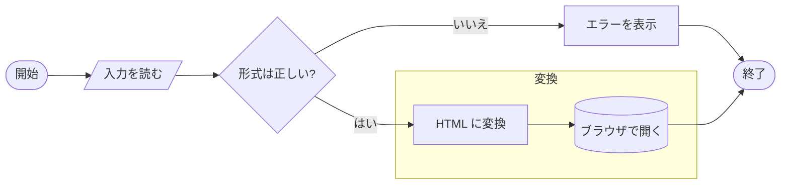

### シーケンス図

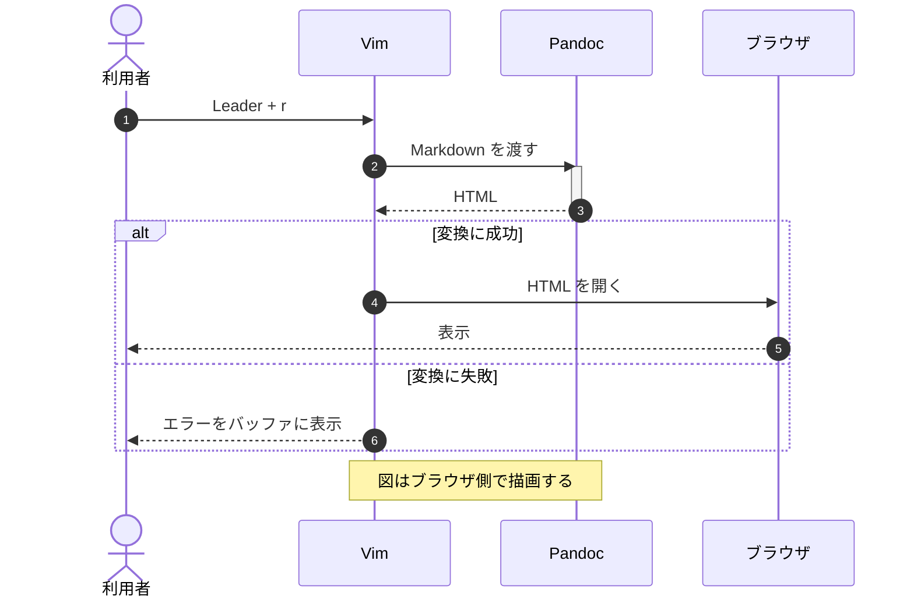

### クラス図

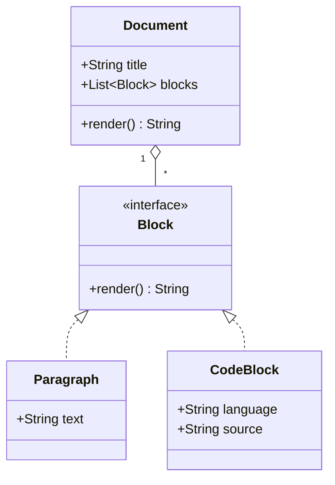

### 状態遷移図

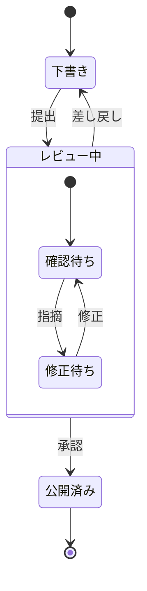

### ER 図

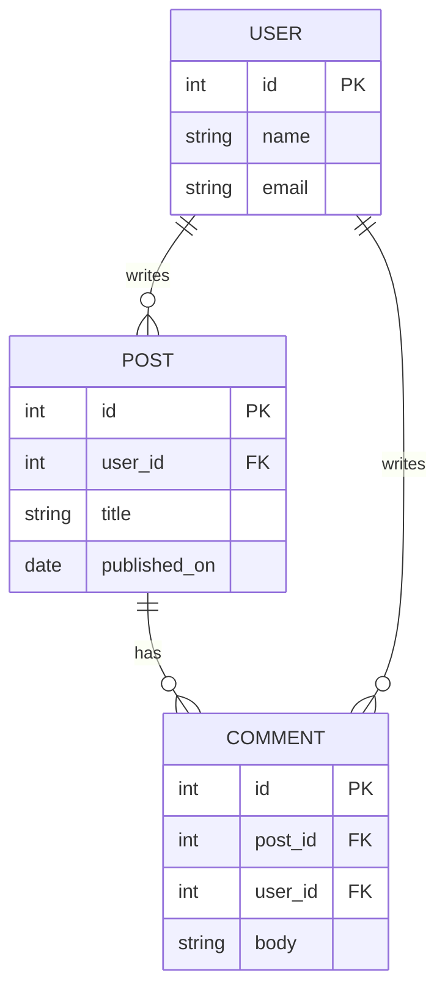

### ガントチャート

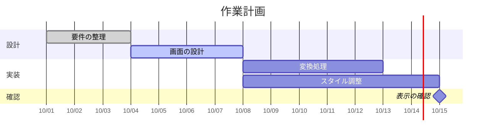

### 円グラフ

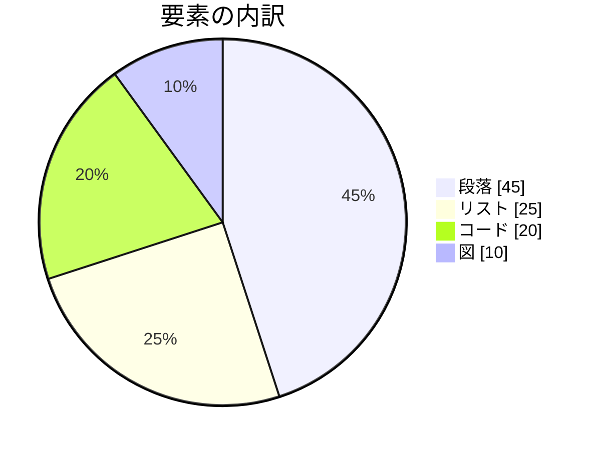

### Git グラフ

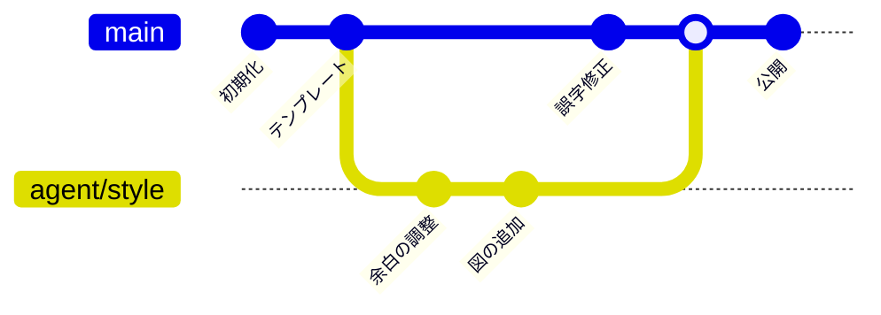

### マインドマップ

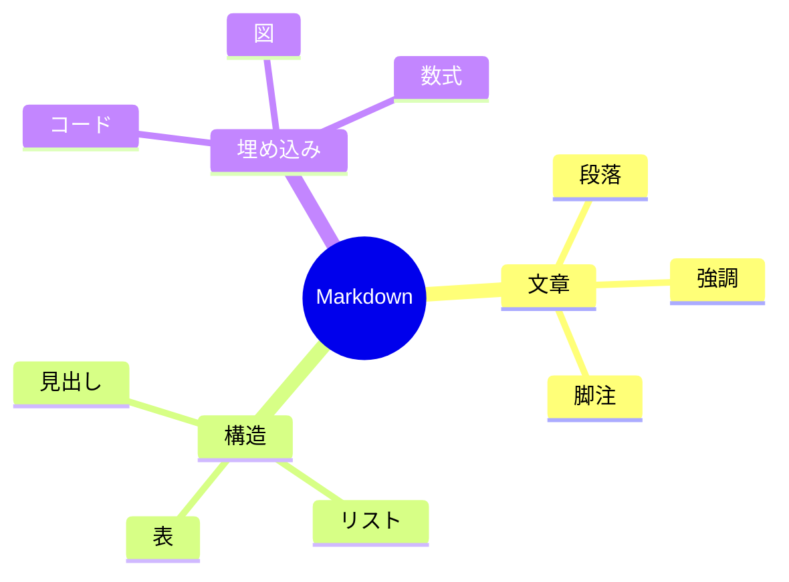

### タイムライン

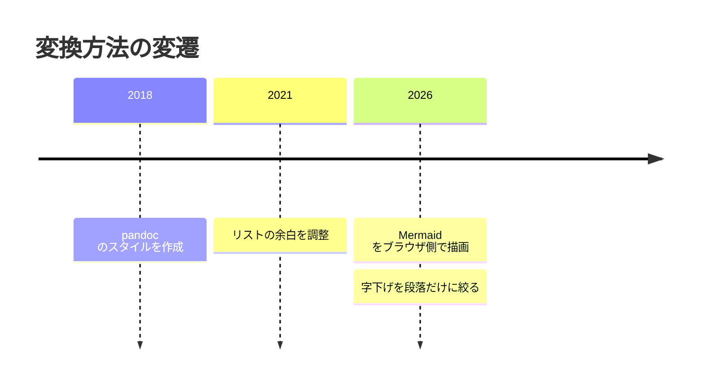

### 象限チャート

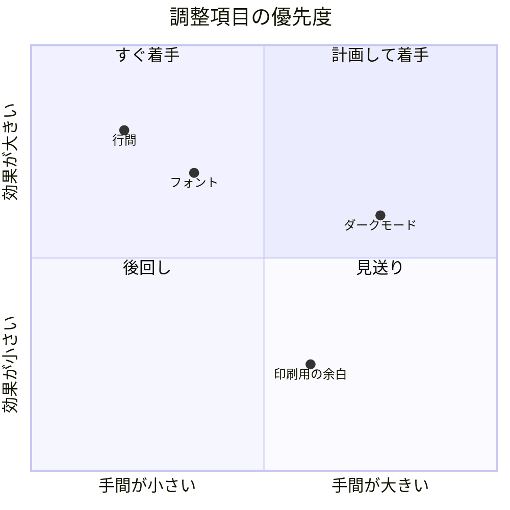

### 構文が誤っている図

```mermaid
これは Mermaid の構文ではない
```

## HTML とその他

水平線の前の段落。

---

水平線の後の段落。

<details>
<summary>折りたたみ</summary>

HTML ブロックの中にも **Markdown** を書ける。

</details>

キー操作は <kbd>Space</kbd> <kbd>r</kbd>、化学式は H<sub>2</sub>O、べき乗は x<sup>2</sup> のように HTML で書く。

::: right
右寄せのブロック (`.right`)。
:::

<div class="page-break"></div>

改ページ (`.page-break`) の後の段落。印刷時だけ、この前でページが変わる。
